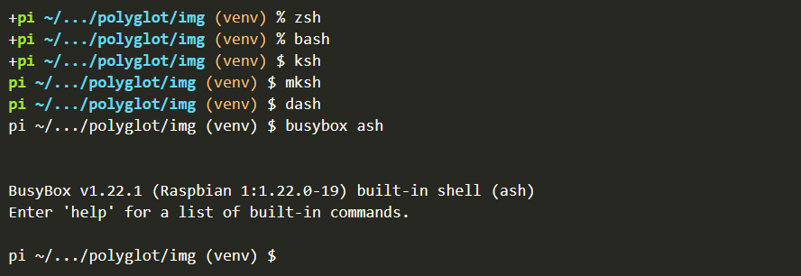

    

# Polyglot Prompt

**Polyglot Prompt** is a dynamic prompt for `zsh`, `bash`, `ksh93`, `mksh`, `pdksh`, `dash`, and `busybox sh` (`ash`) that uses basic ASCII symbols (and color, when possible) to show:

* the username
* whether a session is local or remote over SSH
* an abbreviated path
* the Git branch and status
* the exit status of the last command, if it was not zero

## Table of Contents

- [Basics](#basics)
- [Installation](#installation)
- [Local and Remote Sessions](#local-and-remote-sessions)
- [Abbreviated Paths](#abbreviated-paths)
- [Git Branch and Status](#git-branch-and-status)
- [Exit Status](#exit-status)
- [Enabling `vi` editing mode in `zsh` and `bash`](#enabling-vi-editing-mode-in-zsh-and-bash)

## Basics

The central functions of the prompt are the same in all supported shells:

Additionally, in `zsh` and in `bash` v4.3 and higher, Polyglot Prompt indicates `vi` insert mode with a `+`, and command mode with a `:`, at the beginning of the prompt:

[See below](#enabling-vi-editing-mode-in-zsh-and-bash) for instructions on how to enable `vi` mode in your shell.

## Installation

Polyglot Prompt uses one script (`polyglot.sh`) that can be sourced from the *rc* file (`.zshrc`, `.bashrc`, `.kshrc`, `.shrc`, or `.mkshrc`) of any supported shell:

    . /path/to/polyglot.sh

Although no framework is required, a shim (`polyglot.plugin.zsh`) is provided to help with certain `zsh` frameworks.

## Local and Remote Sessions

When a session is local, only the username is shown; when it is remote over SSH (or `mosh`), the hostname is also shown:

*Note: It is exceedingly difficult to determine with accuracy whether a superuser is connected over SSH or not. In the interests of providing useful and not misleading information, this prompt always displays both username and hostname for a superuser in reverse video.*

## Abbreviated Paths

In all shells, by default Polyglot Prompt emulates the behavior that `bash` uses when `PROMPT_DIRTRIM` is set to `2`: a tilde (`~`) is prepended if the working directory is under the user's home directory, and then if more than two directory elements need to be shown, only the last two are displayed, along with an ellipsis, so that

    /home/pi/src/neovim/config

is displayed as

whereas

    /usr/src/sense-hat/examples

is displayed as

that is, without a tilde.

If you would like to display a different number of directory elements in your Polyglot Prompt, set the environment variable `$POLYGLOT_PROMPT_DIRTRIM` in an *rc* file thus:

    POLYGLOT_PROMPT_DIRTRIM=4     # Or whatever number you like

## Git Branch and Status

If the current directory contains a Git repository, Polyglot Prompt displays the name of the working branch, along with some symbols to show changes to its status:

Git Status | Symbol
--- | ---
Modified | !
Deleted | x
Untracked | ?
New file(s) | +
Ahead | \*
Renamed | >

## Exit Status

If the exit status of the most recently executed command is other than zero (zero indicating success), the exit status will be displayed to the left of the prompt:

## Enabling `vi` editing mode in `zsh` and `bash`

The Polyglot Prompt does not enable `vi` editing mode for you. In `zsh`, you may add

    bindkey -v

to your `.zshrc`; for `bash`, either put

    set-editing-mode vi

in your `.inputrc` or

    set -o vi

in your `.bashrc`.
